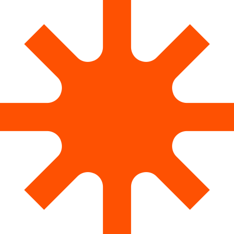
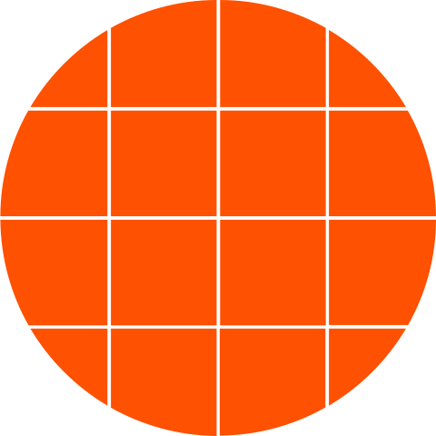
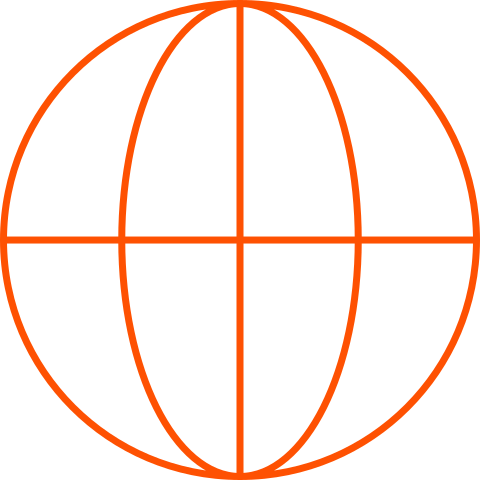

# Hi, I'm Vasu 👋

I'm an **AI builder** who ships production multi-agent systems — turning messy real-world problems into agents that plan, reason, and act with humans in the loop. I work end-to-end: from the LLM orchestration layer down to the data, infra, and the guardrails that keep it safe to ship.

Lately I've been building agentic systems with **FastAPI · LangChain / Deep Agents · Claude & GPT-5 · PostgreSQL · React**, and authoring **Claude Code skills** that automate my own workflow. I care about doing it right — context-first development, EU AI Act compliance, and security/abuse audits *before* anything goes live.

##  &nbsp;What I'm building

- **[OpenToWork](https://github.com/cvas-544/OpenToWork)** — Self-hosted multi-agent job-intelligence system: n8n + Claude API + PostgreSQL + React dashboard.
- **[finsense_ai](https://github.com/cvas-544/finsense_ai)** — Privacy-first personal-finance multi-agent system on the GAME framework: Claude AI, FastAPI, PostgreSQL (AWS RDS), native iOS app.
- **beyondSnap** — E-commerce platform with AI-assisted product workflows. *(private repo)*

##  &nbsp;Stack

##  &nbsp;Find me around the web

---

📍 Germany · Build. Grow. Serve.

